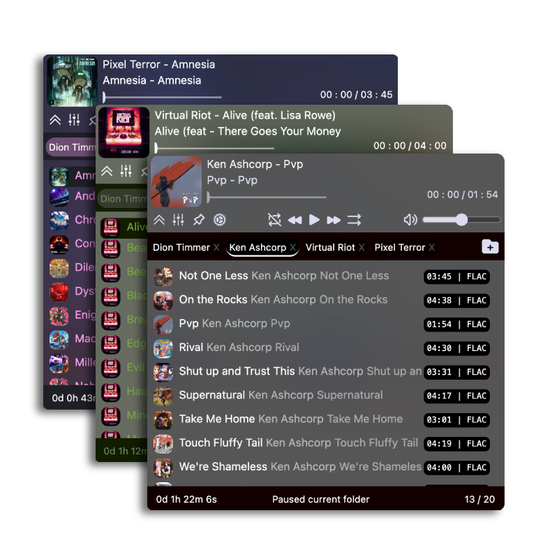

# qmp

A compact, pretty, and cross-platform music player.

# What is it 🐵

It is a music player that is:

- Inspired by [Ionica](https://ionica.app/) and [Winamp](https://winamp.com/)
- Minimalistic
- Customizable
- Cross-platform

# What it is <u>not</u> 🙈

- A lightweight player (using electron guarantees a 300-500Mb binary size)
- A low-RAM player (once again because electron)
- An online/remote audio player

# Why make it ❔

I liked the Ionica UI and features. Yet, it is MacOS only, has features I do not need, and requires paying for the full feature set. So I wanted to make something just as simple & minimalistic but at the same time cross-platform, fully free, and customizable to my liking.

# Screenshots

  

# Development Status 🚥

Status: In progress (see feature roadmap below)\
Progress: Minimal set of features is done - app is more or less usable

# Feature roadmap 🚧

### Basic Features

- [x] Add / Remove directories and load tracks
- [x] Basic audio controls: play, pause, loop, shuffle, seek, etc.
- [x] Load & display metadata and covers
- [x] Save & load user settings
- [x] Save & restore previously open directories and track
- [ ] Create playlists (via drag & drop) rather than loading an entire directory
  - [ ] Rearrange tracks in a playlist / directory
- [ ] Any kind of an equalizer
- [ ] Choose custom output device
- [ ] Filter tracks by name / artist / album / genre
- [ ] Shortcuts & keyboard controls

### Fancy Features

- [x] Animations / transparency effects (OS dependent)
- [x] Customizable UI colors
  - [ ] Save and load multiple UI themes
- [x] Use colors from cover art for the track area background
  - [x] Move colors while the track is playing
- [x] Always on top mode
- [x] Frameless window mode with proper dragging
  - [x] MacOS traffic lights for all operating systems when in frameless mode
- [x] Minified mode (like in both Winamp and Ionica)
  - [ ] Super-minified mode (Ionica)
- [x] Export cover art by clicking on it
- [ ] Display cover art and metadata for a track in a dedicated window
  - [ ] Edit metadata in this mode
- [ ] Any kind of an audio visualizer
- [ ] Better audio controls & options
  - [ ] Crossfade
  - [ ] Preamp
  - [ ] Playback speed

### Will not implement & reasoning

- Play tracks from anywhere other than a local drive
  - Too much pain + I will not use these features myself
- Full screen mode
  - Too much empty space, does not feel like Winamp or Ionica
- Video playback
  - This is not meant to be a media player
- Anything that would make the UI cluttered / unintuitive
  - Self-explanatory

# Tech used 🛠️

- Electron
- ReactJS
- Typescript
- Tailwind CSS
- Vite
- Prettier

# Related projects & apps 🔗

- [Dopamine](https://github.com/digimezzo/dopamine)
- [DuskPlayer](https://github.com/Aveek-Saha/DuskPlayer)
- [Ionica](https://ionica.app/)
- [IINA](https://github.com/iina/iina)
- [Musikcube](https://github.com/clangen/musikcube)
- [Wacup](https://getwacup.com/)
